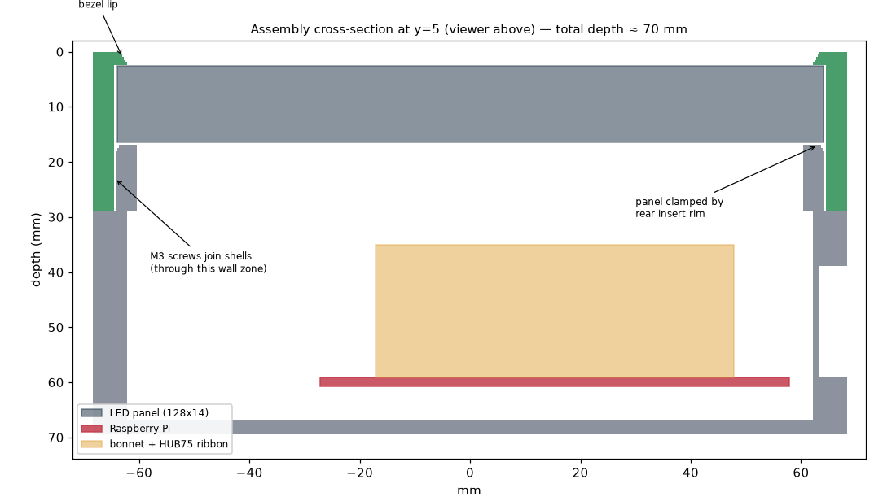

# Nodeice Board — 3D-Printable Case

A two-part case for the Nodeice Board LED matrix showpiece:

- **Front frame** (`stl/nodeice_case_front.stl`) — holds a 32×32 P4 RGB LED
  matrix panel (128 × 128 × 14 mm, e.g. Pimoroni COM-B007) behind a slim
  2 mm bezel with a bevelled opening so the lip doesn't shadow the edge
  pixels.
- **Rear shell** (`stl/nodeice_case_rear.stl`) — houses a Raspberry Pi
  (B form factor: Pi 3/4) with an Adafruit RGB Matrix Bonnet, and clamps
  the panel in place with its rim when the two halves are screwed together.

The panel is held by a **sandwich**, not by its rear mounting holes (those
vary between panel manufacturers): the front lip retains the face, the rear
shell's insert rim presses the panel's plastic frame from behind. Overall
size: **137 × 137 × ~70 mm**.



## Features

- Opening on the **right wall** for the Pi's USB/Ethernet ports (Meshtastic
  node cable) and one on the **bottom wall** for power/HDMI cable routing
- **6.5 mm hole in the top wall** for an SMA antenna passthrough
- Vent slots in the top wall and back wall (LED panels get warm)
- Two **keyhole slots** (80 mm apart) on the back for wall hanging
- Fully parametric OpenSCAD source — every dimension is a named variable

## Bill of materials

| Qty | Item | Purpose |
|-----|------|---------|
| 4 | M3 × 8 mm self-tapping screws (pan head) | Join the two shells (2 per side) |
| 4 | M2.5 × 6 mm self-tapping screws | Mount the Pi on its posts |
| — | Thin foam tape (optional) | On the rear rim, snugs the panel if your panel frame is slightly thinner |

## Printing

| Setting | Value |
|---------|-------|
| Material | **PETG recommended** (panel + Pi generate heat; PLA can creep), PLA fine indoors at ≤60% brightness |
| Layer height | 0.2 mm |
| Perimeters | 3 |
| Infill | 20 % |
| Supports | **None needed** |
| Orientation | Front: bezel face down. Rear: back wall down (as exported) |

Both parts fit a 150 × 150 mm bed and together use roughly 260 g of filament.

## Assembly

1. Mount the Pi (with bonnet) on the four posts inside the rear shell,
   ports facing the wall opening. Plug the HUB75 ribbon into the bonnet and
   connect the bonnet's panel power leads.
2. Drop the panel into the front frame **face first** (it inserts from the
   back). Check its input HUB75 connector is oriented toward where the
   ribbon will reach.
3. Connect the ribbon and power leads to the panel, route the power cable
   out through the bottom opening (and the antenna through the top hole).
4. Slide the rear shell's insert into the front frame's collar until the
   rim seats against the panel back.
5. Drive the four M3 screws through the side holes into the internal bosses.

## Customizing

Everything is parametric in `nodeice_case.scad`. The parameters most likely
to need adjustment:

| Parameter | Default | When to change |
|-----------|---------|----------------|
| `panel_size` / `panel_thickness` | 128 / 14 | Different panel (measure yours!) |
| `panel_fit` | 0.5 | Panel too tight/loose in the frame |
| `insert_fit` | 0.2 | Shells too tight/loose (printer-dependent) |
| `pi_bonnet_stack` | 38 | Different SBC or taller ribbon dressing |
| `usb_opening` / `power_opening` | 64×20 / 52×18 | Different port layout |
| `antenna_hole_d` | 6.5 | 0 disables the antenna hole |

Re-export after changes:

```bash
openscad -o stl/nodeice_case_front.stl -D 'part="front"' nodeice_case.scad
openscad -o stl/nodeice_case_rear.stl  -D 'part="rear"'  nodeice_case.scad
```

Set `part = "assembly"` in the OpenSCAD GUI for a fit-check view with panel
and Pi ghosts.

## Notes

- The bezel lip overlaps the panel face by only 2 mm and is bevelled
  outward, so the outermost LED row stays visible even at shallow angles —
  P4 panels are edge-to-edge pixels.
- The rear rim expects the panel's outer ~4 mm to be flat plastic frame
  (true for common P4 128 mm panels). If your panel has components right at
  the edge, add foam tape pads to the rim instead.
- The case was designed and clearance-checked programmatically; the STLs
  are verified watertight single solids. But printers vary — if the insert
  is too snug, increase `insert_fit` by 0.1 and re-export.
